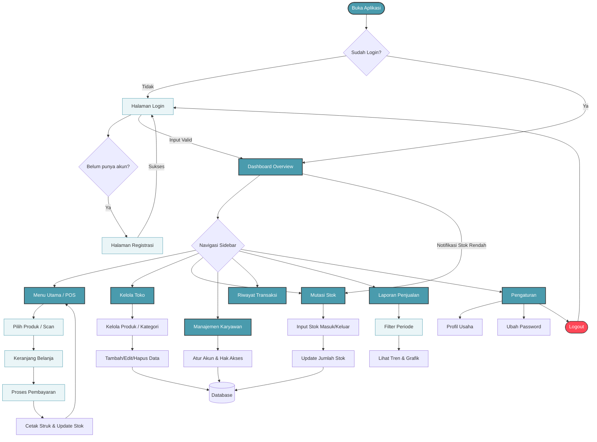

# Arus Kerja Aplikasi (Flowchart)

Berikut adalah diagram alir (*flowchart*) yang menjelaskan logika utama dan navigasi dalam aplikasi Pointly POS ini.

### Penjelasan Singkat:

1.  **Halaman Utama (Dashboard)**: Memberikan ringkasan penjualan dan notifikasi stok yang menipis.
2.  **Transaksi (POS)**: Alur kasir di mana produk dipilih, dimasukkan ke keranjang, dan diselesaikan melalui pembayaran yang otomatis memotong stok.
3.  **Manajemen Data**: Tempat Owner mengatur katalog produk, kategori, dan mendaftarkan karyawan (Kasir/Admin) beserta hak aksesnya.
4.  **Logika Stok**: Setiap barang masuk atau keluar dicatat di Mutasi Stok untuk transparansi data.
5.  **Laporan**: Data transaksi diolah menjadi grafik tren penjualan untuk membantu pengambilan keputusan bisnis.
6.  **Keamanan**: Menggunakan sistem *multi-tenancy*, memastikan data antar toko tidak saling bercampur.
